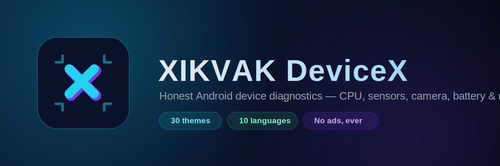
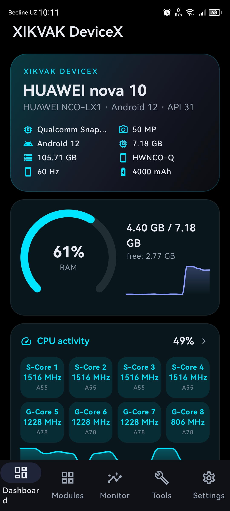
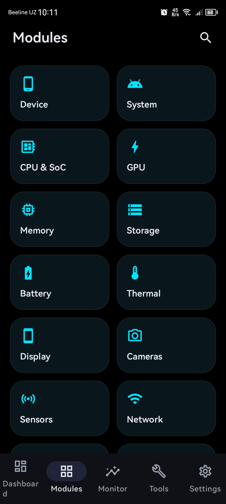
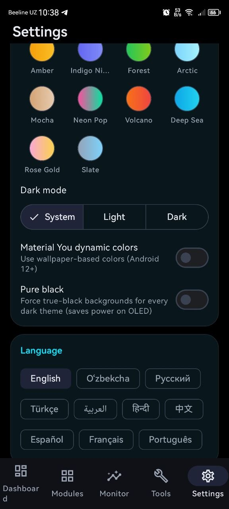

[-blue)](#)

**A no-nonsense Android diagnostics app — every number comes from a real API, or it's honestly marked as unavailable.**

[Download APK](../../releases/latest) · [Features](#-features) · [Screenshots](#-screenshots) · [Install](#-installation) · [Support](#-support-the-project)

---

## 📱 About

**XIKVAK DeviceX** is a from-scratch Android device diagnostics app in the spirit of CPU‑Z, DevCheck, and AIDA64 — built around one strict rule: **if a value can't be read from a real Android or Linux system interface, it's marked `Estimated`, `Unavailable`, or `Permission required`. It is never invented.**

This repository distributes the **compiled APK only** — no source code, no build files. If a value shown by the app looks wrong for your device, it means the platform genuinely didn't expose it, not that the app is guessing.

## ✨ Features

- **14 detail modules** in one swipeable pager (swipe left/right or tap the top tabs): Device, System, CPU & SoC, GPU, RAM, Storage, Battery, Thermal, Display, Cameras, Sensors, Network, Multimedia, Security
- **Live monitoring** — CPU frequency, RAM, battery current, thermal zones, network throughput, and this app's own UI frame rate, all with rolling charts
- **Benchmarks** — single/multi-core CPU, floating point, RAM bandwidth, storage sequential read/write
- **History & reports** — save timestamped snapshots, diff two snapshots to see what changed, export full reports as JSON/TXT/CSV
- **Search** — one search box across every module and every reading
- **Hardware tests** — flashlight, vibration, speaker tone, earpiece, multi-touch (holds the peak simultaneous-touch count), proximity/light/accelerometer/gyroscope live readouts, display gradient/dead-pixel check, left/right speaker channel test
- **30 hand-picked color themes**, light/dark/system mode, Material You dynamic color (Android 12+), and a **Pure Black (AMOLED)** mode that forces true `#000000` everywhere, including the bottom navigation bar
- **10 languages**, fully localized — every UI string and every module label (not just the screens, the "Manufacturer", "Voltage", "Governor"-style field names too) switches instantly, no restart
- **Camera detail** — reads every accessible Camera2 characteristic (aperture, sensor size, ISO range, OIS/EIS, RAW support, hardware level) and cross-references known public sensor/device specs where the platform itself won't expose the true resolution
- **No ads, ever.** No analytics, no tracking SDKs.

## 📸 Screenshots

> Add your own screenshots here once you've built and installed the app — a phone running the Dashboard, a Modules detail page, and the Settings theme picker are good ones to show. Recommended: PNG, phone aspect ratio, dropped into `docs/screenshots/` and referenced like:
>

  

## 📥 Installation

1. Go to the **[Releases](../../releases)** page and download the latest `.apk`.
2. On your phone, go to **Settings → Apps → Special access → Install unknown apps**, and allow your browser or file manager to install APKs. (Exact wording varies by Android version/vendor.)
3. Open the downloaded file and tap **Install**.
4. Requires **Android 6.0 (Marshmallow, API 23) or newer**.

Camera and Location/Phone permissions are requested only where needed (reading exact sensor megapixels, or the Wi‑Fi network name / precise mobile network type) — every optional feature works and clearly states what's missing if you decline.

## 🔐 Permissions

| Permission | Why it's requested |
|---|---|
| Camera | Reads exact sensor characteristics (megapixels, aperture, ISO range). Never captures or stores a photo. |
| Location (fine) | Required by Android to reveal the connected Wi‑Fi network name and BSSID. |
| Phone state | Required to read the precise mobile network generation (5G/4G/etc). |
| Vibrate | Used only by the Hardware Tests → Vibration test. |

All are optional — the app functions without them, showing `Permission required` for the specific readings that need them.

## 🌍 Languages

English · Oʻzbekcha · Русский · Türkçe · العربية · हिन्दी · 中文 · Español · Français · Português

## 💬 Support the project

DeviceX is free and has no ads — and it will stay that way. If it's useful to you, a donation of any size keeps development alive:

- **Card (Visa):** `4916 9903 1117 9219`
- **Card holder:** XIKVAK
- **Telegram:** [@XlKVAK](https://t.me/XlKVAK)
- **Email:** [xikvak3@gmail.com](mailto:xikvak3@gmail.com)

And if a donation isn't possible — a sincere prayer for the developer is more than enough. Thank you!

Found a bug, or have a feature idea? Reach out through Telegram or email above, or open an [issue](../../issues).

## ⚠️ Disclaimer

XIKVAK DeviceX is an independent project and is not affiliated with, endorsed by, or sponsored by Google, Qualcomm, Xiaomi, Samsung, or any device manufacturer mentioned in its output. Sensor, chipset, and camera readings are as accurate as the Android platform and your device's vendor allow — some fields are vendor-restricted and will honestly show as unavailable rather than a guess.

## 📄 License

MIT License

Copyright (c) 2026 xikvak3

Permission is hereby granted, free of charge, to any person obtaining a copy
of this software and associated documentation files (the "Software"), to deal
in the Software without restriction, including without limitation the rights
to use, copy, modify, merge, publish, distribute, sublicense, and/or sell
copies of the Software, and to permit persons to whom the Software is
furnished to do so, subject to the following conditions:

The above copyright notice and this permission notice shall be included in all
copies or substantial portions of the Software.

THE SOFTWARE IS PROVIDED "AS IS", WITHOUT WARRANTY OF ANY KIND, EXPRESS OR
IMPLIED, INCLUDING BUT NOT LIMITED TO THE WARRANTIES OF MERCHANTABILITY,
FITNESS FOR A PARTICULAR PURPOSE AND NONINFRINGEMENT. IN NO EVENT SHALL THE
AUTHORS OR COPYRIGHT HOLDERS BE LIABLE FOR ANY CLAIM, DAMAGES OR OTHER
LIABILITY, WHETHER IN AN ACTION OF CONTRACT, TORT OR OTHERWISE, ARISING FROM,
OUT OF OR IN CONNECTION WITH THE SOFTWARE OR THE USE OR OTHER DEALINGS IN THE
SOFTWARE.
---

Made with care · No ads · No tracking

